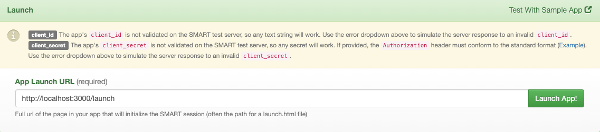
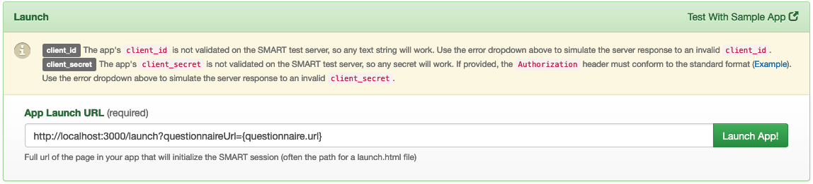

# SMART Forms

---

Smart Forms is a Typescript-based [React](https://reactjs.org/) web application currently ongoing development by CSIRO AEHRC as part of the Primary Care Data Quality project funded by the Australian Government Department of Health.

The prototype is intended to demonstrate the use of HL7 FHIR Specifications to provide a shared Smart Health Check application that can be launched by a primary care Practice Management System (PMS) and capture standardised health check information for healthcare client.

This project was bootstrapped with [Create React App](https://github.com/facebook/create-react-app).

This repository contains the Smart Forms React app and a module containing functionality from the SDC (Structured Data Capture) Specification of HL7 FHIR: http://hl7.org/fhir/uv/sdc/

**This project is still ongoing development and should only be used for testing purposes only.**


## Setup Development Environment

### Prerequisites

The project requires the following prerequisites:

- Download and install Node.js from [nodejs.org](https://nodejs.org/en/download/)

### Clone Git Repository

Clone this Git source repository onto your local machine from https://github.com/aehrc/smart-forms.

### Initialise App dependencies

Install dependencies.

```sh
npm install
```

## Run app

Change directory into the directory containing the React app.

```sh
cd apps/smart-forms-react-app
```

Start the local server.

```sh
npm start
```

### Running on SMART EHR (the preferred way)

1. Open https://launch.smarthealthit.org/ in a browser.
2. Set the **App Launch URL** at the bottom of the page as ```http://localhost:3000/launch``` and launch app.



3. Alternatively, launch a specified questionnaire directly to launch a questionnaire directly with ```http://localhost:3000/launch?questionnaireUrl={questionnaire.url}``` with questionnaire.url being the absolute URI of the questionnaire: https://hl7.org/FHIR/questionnaire-definitions.html#Questionnaire.url



### Running without a patient

This method of running the app does not allow you to save responses as it is not connected to a CMS client.

1. Open http://localhost:3000 in a browser.


