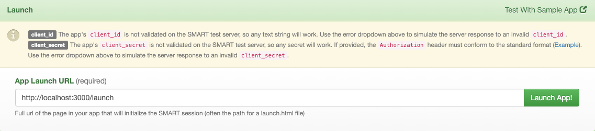

# SMART Health Checks

---

Smart Health Checks is a Typescript-based [React](https://reactjs.org/) web application currently ongoing development by CSIRO AEHRC as part of the Primary Care Data Quality project funded by the Australian Government Department of Health.

The prototype is intended to demonstrate the use of HL7 FHIR Specifications to provide a shared Smart Health Check application that can be launched by a primary care Practice Management System (PMS) and capture standardised health check information for healthcare client.

This project was bootstrapped with [Create React App](https://github.com/facebook/create-react-app).

**This project is still ongoing development and should only be used for testing purposes only.**


## Setup Development Environment

### Prerequisites

The project requires the following prerequisites:

- Download and install Node.js from [nodejs.org](https://nodejs.org/en/download/)

### Clone Git Repository

Clone this Git source repository onto your local machine from https://bitbucket.csiro.au/scm/smarthc/smart-health-checks.git.

### Initialise App dependencies

Change directory into the cloned repository folder.

```sh
cd smart-health-checks
```

Install the package dependencies.

```sh
npm install
```

## Run app

Start the local server.

```sh
npm start
```

### Running on SMART EHR (the preferred way)

1. Open https://launch.smarthealthit.org/index.html in a browser.
2. Set the **App Launch URL** at the bottom of the page as ```http://localhost:3000/launch``` and launch app.



### Running without a patient
1. Open http://localhost:3000/ in a browser.


